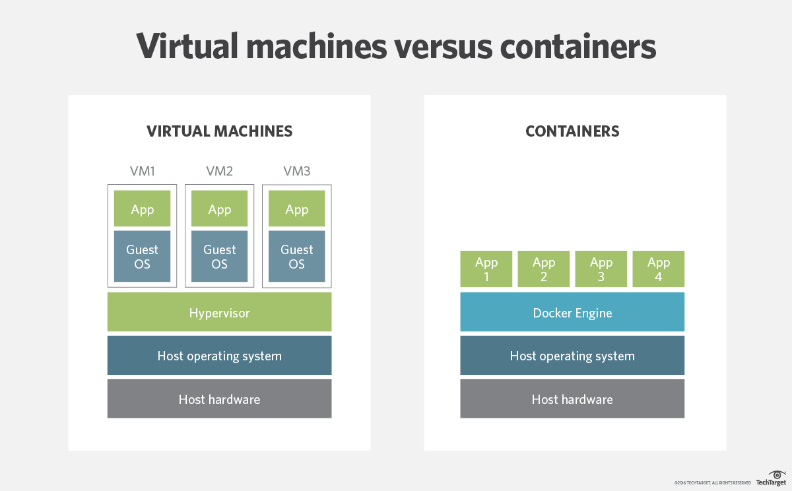

Software containers are lightweight, stand-alone, executable packages
that includes everything needed to run: code, runtime, system tools,
system libraries, settings.

Containers are similar to virtual machines, however, the virtualization
happens at a different point. 

{: style="width: 50%;" }
*Image source: [TechTarget]*

Although it can be hard to give a quick answer as to which one to use,
Jack Wallen at [TechRepublic] boils it down to the following two questions:
- Do you need a full platform that can house multiple services? Go with a virtual machine.
- Do you need a single service that can be clustered and deployed at scale? Go with a container.

> ## Prerequisites
>
> You should have a basic familiarity with Unix shell navigation.
{: .prereq}

[TechTarget]: https://searchservervirtualization.techtarget.com/answer/Containers-vs-VMs-Whats-the-difference
[TechRepublic]: https://www.techrepublic.com/article/containers-vs-virtual-machines-a-simplified-answer-to-a-complex-question/
